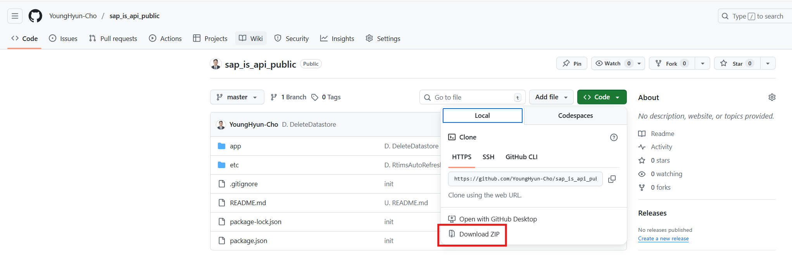

# 사용 방법

<br />

### VS Code 설치
- Google에서 VS Code 검색하여 PC에 설치

<br />

### Node.js 설치 
- Google에서 Node.js 검색하여 PC에 설치
- 설치 완료 후 터미널에서 확인
    - 아래 두 명령어 입력 시 버전이 출력되어야 함. 
        - `node -v`
        - `npm -v`
- 참고 : Node.js란? 
    - 자바스크립트를 로컬에서 실행시킬 때 필요한 런타임 환경
- 참고 : npm -v 시 오류가 발생하는 경우
    - Power Shell을 '관리자 권한'으로 열고, 아래 명령어 입력
        - `Set-ExecutionPolicy RemoteSigned -Scope CurrentUser`
    - VS Code 재시작

<br />

### 소스 다운로드
- 깃헙 레포지토리 내 Code - Download ZIP 클릭
- 다운로드 경로는 One Drive 등 드라이브에서 관리하지 않는 위치 추천
- 다운로드 후 압축 풀기



<br />

### VS Code에서 프로젝트
- VS Code 열고 상단 메뉴에서 File - Open Foler 클릭
- 압축을 푼 폴더가 있는 경로로 이동하여 화면에 `app`, `etc` 폴더가 있는 경로까지 이동 후 `Select Folder(폴더 선택)` 클릭

<br />

### 의존성 라이브러리 다운로드
- `Ctrl` + ``` ` ``` 입력하여 터미널 열기
    - ``` ` ``` : 숫자 1 왼쪽 버튼
- 터미널에서 `npm install` 입력하여 의존성 라이브러리 다운로드

<br />

### API 호출 정보 설정
- destConfig.json 파일 만들고 아래와 같은 형식으로 API 호출 정보 설정

```json
{
    "COMPANY_NAME1": {
        "DEV": {
            "tag": "DEV",
            "API_URL": "https://....cfapps.ap12.hana.ondemand.com",
            "BASIC_AUTH": {
                "ID": "...",
                "PW": "...",
                "TOKEN_URL": "https://....authentication.ap12.hana.ondemand.com/oauth/token"
            }
        },
        "QAS": {
            "tag": "QAS",
            "API_URL": "https://....cfapps.ap12.hana.ondemand.com",
            "BASIC_AUTH": {
                "ID": "...",
                "PW": "...",
                "TOKEN_URL": "https://....authentication.ap12.hana.ondemand.com/oauth/token"
            }
        },
        "PRD": {
            "tag": "PRD",
            "API_URL": "https://....cfapps.ap12.hana.ondemand.com",
            "BASIC_AUTH": {
                "ID": "...",
                "PW": "...",
                "TOKEN_URL": "https://....authentication.ap12.hana.ondemand.com/oauth/token"
            }
        }
    },
    "COMPANY_NAME2": {
        "DEV": {
            "tag": "DEV",
            "API_URL": "https://....cfapps.ap12.hana.ondemand.com",
            "BASIC_AUTH": {
                "ID": "...",
                "PW": "...",
                "TOKEN_URL": "https://....authentication.ap12.hana.ondemand.com/oauth/token"
            }
        },
        "QAS": {
            "tag": "QAS",
            "API_URL": "https://....cfapps.ap12.hana.ondemand.com",
            "BASIC_AUTH": {
                "ID": "...",
                "PW": "...",
                "TOKEN_URL": "https://....authentication.ap12.hana.ondemand.com/oauth/token"
            }
        },
        "PRD": {
            "tag": "PRD",
            "API_URL": "https://....cfapps.ap12.hana.ondemand.com",
            "BASIC_AUTH": {
                "ID": "...",
                "PW": "...",
                "TOKEN_URL": "https://....authentication.ap12.hana.ondemand.com/oauth/token"
            }
        }
    },
    ...
}
```
<br />

### 작업 설정
- Application.js 또는 BatchApplication.js에서 아래 내용 설정
    - 수행할 작업 (예 : `OPERATION = Deploy`)
    - 작업 수행 대상 사이트 (예 : `SITE = COMPANY_NAME1`)
    - 작업 수행 대상 환경 (예 : `DESTINATION = DEST_ENUM.DEV`)
- functions에서 작업 대상 인터페이스 이름 또는 패키지 등을 설정
- 작업 및 작업 대상 최종 확인 후 Application.js 또는 BatchApplication.js의 `confirmed`에 `true` 할당 

<br />

### 실행
- 프로젝트 루트 경로에서 아래 명령어 입력하여 실행
    - 일반 작업 : `node ./app/Application.js`
    - 스케줄링 작업 : `node ./app/BatchApplication.js`

<br />

### 주의 
- 스케줄링 작업의 경우 DatastoreUsage.js만 사용하세요.
- 사용 시 설정 사항을 꼼꼼하게 사용 후 실행하세요. 